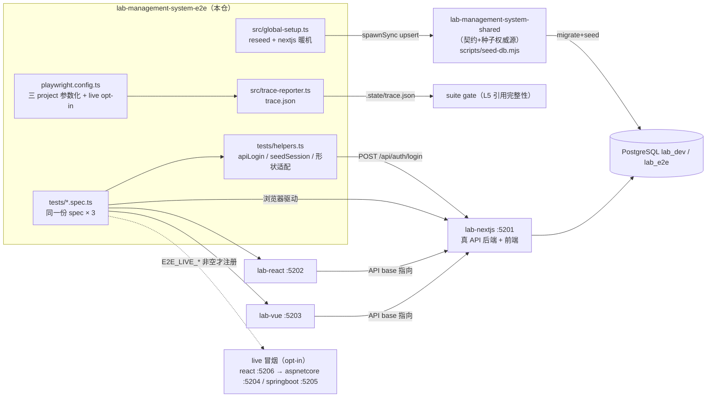
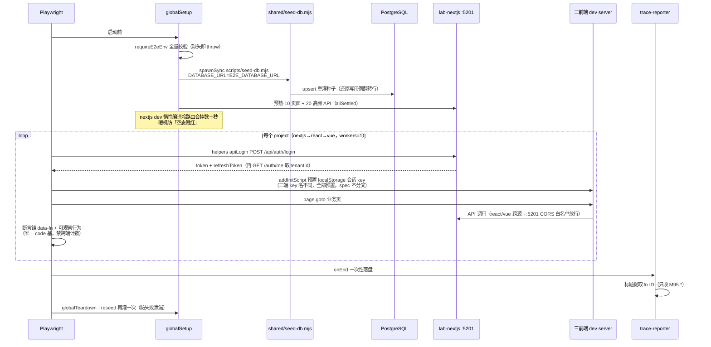

# lab-management-system-e2e 架构

> 一句话定位：lab-management-system 家族的 **e2e 仓**——同一套 Playwright spec 参数化跑 react/vue/nextjs 三个前端 baseURL，验证三端交互、状态与异常路径对用户不可区分（ADR-0030；lab 家族落地 ADR-0033 阶段三）。

生成日期：2026-09-22 ｜ 锚定 HEAD：8a43dd4 ｜ 生成方式：DeepWiki 风格架构扫描

## 1. 总览

- **定位与职责**：家族 6 角色中的 **e2e**。端到端测试仓——驱动真实前端 + 真实后端跑用户旅程，不写业务代码、不自起被测服务。API 级黑盒 parity 由 contract-test 仓兜底，本仓负责**浏览器级**行为一致性。
- **技术栈**：Playwright（`@playwright/test` ^1.63.0）+ TypeScript ^7.0.2（`package.json`）；CI node 22、chromium 单浏览器。无业务运行时依赖。
- **核心不变量（ADR-0030）**：
  - **用例禁止分叉**——同一份 spec × 三 project，spec 内出现 per-端分支 = parity 失效；
  - **选择器只锚 `data-fn` 与用户可观察行为**，禁止锚 DOM 结构/组件库/CSS；
  - **本仓不自起被测服务**——4 个被测进程外部起好，连接被拒是环境错误不是用例失败；
  - env 全 fail-fast，禁默认值兜底（suite 硬规则 §1）。
- **规模速览**：`tests/` 14 个 spec（39 处静态 `test()` 声明，report-workflow 另由循环按四阶段参数化）× 3 project；`src/` 4 个基建文件（约 218 行）+ `tests/helpers.ts`（333 行）；功能清单保留命名空间 M95 共 4 个功能 / 16 个 I 级子项（`docs/functions/function-tree.md`）。

## 2. 系统架构

关键边界：

- **本仓对被测系统只有两类触点**——HTTP/DB 调用（globalSetup 种子重灌、API 登录）和 Playwright 浏览器驱动；不起任何服务。
- **三前端共享一个有状态真后端**（lab-nextjs :5201，DB 持久化），因此断言全部走唯一 code/brand 基，`workers: 1` 串行求确定性。
- **shared 仓是种子与迁移的权威源**：globalSetup 以 sibling 相对路径直接 spawn `scripts/seed-db.mjs`，不复制种子。
- **live 冒烟是独立象限**：仅当 `E2E_LIVE_URL` 非空才注册第 4 个 project，与默认三 project 双向 `testMatch` 隔离。

## 3. 模块分解

| 模块/目录 | 职责 | 关键文件 |
|---|---|---|
| 运行时基建（`src/`） | env fail-fast 加载、种子重灌 + nextjs 暖机、trace 产物 | `src/env.ts`、`src/global-setup.ts`、`src/global-teardown.ts`、`src/trace-reporter.ts` |
| 三端参数化入口 | project 定义、顺序固定 nextjs→react→vue、live opt-in | `playwright.config.ts` |
| 公共助手（`tests/helpers.ts`） | API 登录 + storage 会话预置、superset 行锚、REF 形状桥接、表单/下拉/确认弹窗 superset 操作 | `tests/helpers.ts`（333 行） |
| 基建自检用例 | 不依赖被测服在场的仓内契约自检 | `tests/env-contract.spec.ts`、`tests/infra-contract.spec.ts` |
| 登录/会话旅程 | SSO authorize/callback（route 虚拟化）、会话预置可达 + 登出清 storage | `tests/login.spec.ts`、`tests/session.spec.ts` |
| 冒烟/指纹旅程 | 全公共路由可达无 5xx、关键列表有数据行（直击死桩假绿）、三端 UI 结构指纹 | `tests/smoke-nav.spec.ts`、`tests/ui-parity.spec.ts` |
| CRUD 旅程 | 合同/委托书/字典/技术要求 列表→建→改→删 × 三端，自产自销 uniqueCode | `tests/contract-crud.spec.ts`、`tests/receipt-crud.spec.ts`、`tests/dict-crud.spec.ts`、`tests/techreq-crud.spec.ts` |
| 深流程旅程 | 数据录入弹窗、报告四阶段工作流 act、Summary 结构 | `tests/data-entry.spec.ts`、`tests/report-workflow.spec.ts`、`tests/summary.spec.ts` |
| live 冒烟 | react 实例指 5204/5205 真后端的登录→报告审核→act→Summary 一发 | `tests/live-smoke.spec.ts`（仅 live project 跑） |
| 文档面 | 功能清单（M95 命名空间）、需求、e2e 运行时约定、设计对齐账 | `docs/functions/function-tree.md`、`docs/conventions/e2e-runtime.md`、`docs/requirements/`、`docs/design/` |
| CI | tag/nightly 触发，sibling clone + 起 dev server + PG service | `.github/workflows/ci.yml` |

注：`docs/adr/` 目录存在但当前为空；被引用的决策记录（ADR-0030/0033）在 suite 仓 `docs/adr/`。

## 4. 数据流 / 请求生命周期

一轮 e2e（`npm run e2e`）的完整链路：

要点：

- **会话建立不走 UI**：三前端 `/login` 都是 SSO orchestrator、无密码表单，密码只被后端 `/api/auth/login` 接受——所以用 API 登录 + localStorage 预置（`seedSession` 用 sessionStorage 旗标保证「本 page 只播一次」，防登出后 init 脚本把 token 种回）。
- **形状分歧桥接放测试缝**：契约裸数组 vs 前端 `{items,total}`、字典行补 id=code，由 `installRefShapeAdapters`（`page.route` 代理）承接，后端保持契约形状不动。（原 spec 内 `installCorsBridge` CORS 缝已删：2026-09-22 lab-nextjs src/middleware.ts 落地 LAB_CORS_ALLOWED_ORIGINS 治本。）
- **trace 只收本仓命名空间 M95.\***：BASE ID 覆盖保留在标题文本供跨仓路径扫描（`src/trace-reporter.ts` 注释：进 BASE 覆盖矩阵是 suite 扩展，待人裁决）。

## 5. 依赖面

- **对 shared 契约仓**：非 npm 依赖，**sibling 目录约定**（`../lab-management-system-shared`）。globalSetup 直接执行其 `scripts/seed-db.mjs`（找不到即 throw）；种子/迁移以 shared 为唯一权威源。CI 用 git clone 到 `../` 保持与本机 dev 布局逐字一致。
- **对家族前端仓**（lab-react :5202 / lab-vue :5203 / lab-nextjs :5201 兼前端+API）：外部起 dev server，且起服时用进程 env 覆盖 API base——react/vue `VITE_API_BASE_URL=http://localhost:5201`，nextjs `NEXT_PUBLIC_API_BASE_URL=`（空=同源）。
- **对家族后端仓**：默认 API 目标 = lab-nextjs :5201（2026-09-17 起 msw 仓已删，切真后端）；live 冒烟另打 lab-aspnetcore :5204 / lab-springboot :5205（各跑一轮，换 env 重跑）。
- **DB**：三端共享真库——本机 `lab_dev`，CI 一次性 `lab_e2e` scratch（用后随 runner 销毁）；family 约定见 MEMORY「家族 PG 三库分层」。aspnetcore/springboot live 轮共库 lab_dev。
- **IdP**：lab SSO authorize/callback 在用例内 route 虚拟化（真 IdP 由 saas-e2e 侧覆盖，`login.spec.ts` AC-1/AC-3）；真实 IdP 不在本仓依赖面内。
- **token 互认**：三前端各自读 `lab.accessToken`/`lab.refreshToken`/`lab.activeTenantId`（react/vue）与 `lab.token`（nextjs），JWT 由 lab-nextjs 签发，全家族同 issuer 互认。

## 6. 配置与部署

### env 变量表（`src/env.ts` + `.env.example`，全 fail-fast 缺失即 throw，无默认值兜底）

| key | 用途 | 缺失行为 |
|---|---|---|
| `E2E_NEXTJS_URL` | nextjs project baseURL（默认 :5201） | requireE2eEnv throw |
| `E2E_REACT_URL` | react project baseURL（:5202） | throw |
| `E2E_VUE_URL` | vue project baseURL（:5203） | throw |
| `E2E_API_BASE_URL` | API 登录 base（`http://localhost:5201/api`） | apiLogin 时 throw |
| `E2E_DATABASE_URL` | 被测 nextjs 实际连的库（globalSetup/teardown reseed 用） | globalSetup throw |
| `E2E_TEST_USERNAME` / `E2E_TEST_PASSWORD` | 家族 DEMO 用户凭据（真值只进 .env.local，不进断言/注释） | apiLogin 时 throw |
| `E2E_LIVE_URL` / `E2E_LIVE_API_BASE_URL` | live 冒烟地址（react :5206 / 后端 :5204 或 :5205） | **空=不注册 live project**（唯一有「缺省合法」语义的键，opt-in 设计） |

env 加载顺序：进程 env（不覆盖已有值）← `.env.local` ← `.env`。`.env.example` 与 `.env.test` 进仓且 key 集合全等（L0.5 契约，`infra-contract.spec.ts` AC-1 自检）。

### 端口与部署

- 端口段 5200（家族 SSOT `multi-repo-family.md` §6）：5201 nextjs / 5202 react / 5203 vue / 5204 aspnetcore / 5205 springboot / 5206 live react 实例（`VITE_DEV_PORT=5206` 避开默认实例）。
- 无 Dockerfile、无部署产物——测试仓不部署。
- CI（`.github/workflows/ci.yml`）：**tag `v*` / nightly / 手动触发**（ADR-0030 Decision 7：不进每 commit）；postgres:16 service 起 `lab_e2e` scratch → sibling clone shared/nextjs/react/vue → 按各仓 `.env.example` 生成 env（sed 锚定整行改值）→ shared migrate+seed → 起 3 dev server → playwright。凭据走 secret `E2E_TEST_PASSWORD`。

## 7. 质量门禁

来自 `.harness/stack.json`（schema 1，stack=`generic`，suite_version 0.6.0）：

| 门 | 名称 | 命令 | 修复指引 |
|---|---|---|---|
| L3 | 类型 | `npx --no tsc --noEmit` | 补全类型 |
| L4 | E2E 三端一致性 | `npx --no playwright test` | 先让用例变绿；需 3 个被测进程在跑 + PG 库 migrate+seed 灌好，没起服连接被拒是环境错误不是用例失败 |

- `trace_cmd` = 同 L4（`npx --no playwright test`），`trace_env` 为空；`source_dirs=["src"]`、`test_dirs=["tests"]`。
- trace 产物：`.state/trace.json`（schema 1，由 `src/trace-reporter.ts` 产出，禁手写）；只收 M95.\* 命名空间，skip/interrupted 用例 fns 必空。live 轮会以 live-only trace 覆盖该文件，full 档 gate 重跑全量即自愈（`e2e-runtime.md` §5.2）。
- 工作循环：suite 根目录跑 `python scripts/gate.py -p lab-management-system-e2e`——**exit 0 = 完成；1 = 按修复提示改代码；2 = 契约/环境问题，停下问人**。exit code 是唯一真相。
