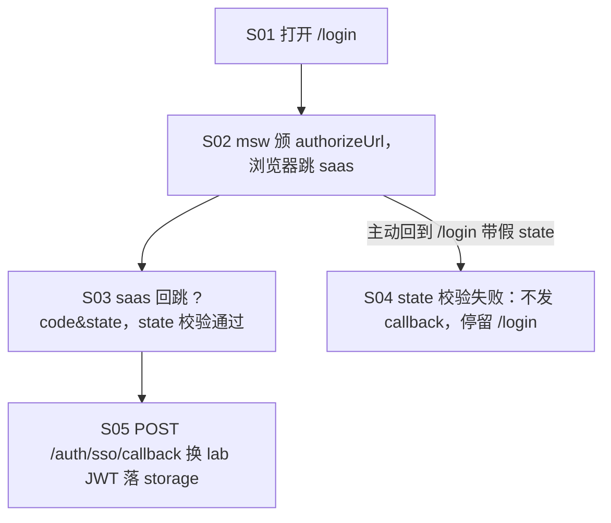

# 流程与功能对齐 — 建筑工程实验室管理系统前端E2E一致性

> 人填、人评审。机器只检查引用的功能 ID 是否存在。
> 评审时把流程图投出来，对每条验收线念「这一步靠哪些功能完成」。念不出来的行，
> 要么流程是空的，要么功能是缺的。这就是对齐的全部意义。

## FLOW-01 三端 SSO 登录主流程

> 本仓唯一入流程的功能是 SSO 登录用例（M95.F02.I01）：它是所有后续验收线的公共前置 ——
> 会话预置失败时所有用例都进不了业务页。state 篡改的退回路径并入本流程 S04，不另设 FLOW-02。
> 其余子项（各业务用例、基建件）自成闭环或属运行容器，见下方孤儿清单。

| 步骤 | 名称 | 角色 | 输入 | 输出 | 状态流转 | 支撑功能子项 |
|---|---|---|---|----|---|---|
| S01 | 打开 /login（无会话） | 访客 | 三端 baseURL（env fail-fast） | 发起 authorize 请求 | — | M95.F02.I01 |
| S02 | msw 返 authorizeUrl（client_id/redirect_uri/state）→ window.location 跳 saas | 访客 | 三端已登记的 SSO client | 浏览器落虚拟 saas authorize 页 | 未登录 → 授权中 | M95.F02.I01 |
| S03 | 回跳 /login?code&state，sessionStorage state 校验通过 | 访客 | code + state | 发起 callback 请求 | 授权中 → 换发中 | M95.F02.I01 |
| S04（退回） | state 被篡改：不发 callback、停留 /login、显示错误 | 访客 | 被偷换的 state | 错误提示可见 | 授权中 → 未登录 | M95.F02.I01 |
| S05 | callback 换 lab JWT，落三端各自 storage key，离开登录页 | 已登录 | callback 响应 | 业务页可达 | 换发中 → 已登录 | M95.F02.I01 |

### 评审时问这四个问题

1. 有没有哪个步骤的「支撑功能子项」是空的？→ 功能缺失，或这一步不该存在
2. 有没有功能子项从头到尾没出现在任何流程里？→ 见下方孤儿清单
3. 状态流转列里的状态名，和代码里的枚举一致吗？→ 未登录/授权中/换发中/已登录 —— lab 前端路由守卫态
4. 退回路径都画了吗？→ 只画正向流程，会漏掉一半功能

### 孤儿功能

不在任何流程里但合法的功能。**没解释的孤儿 = 没人要的功能。**
本仓是 E2E 验证层：每条业务用例是独立验收线（会话预置后各自起闭环），
基建件是运行容器/产物加工 —— 它们不是「用户流程的步骤」，全部合法孤儿。

| 功能 ID | 为什么合法 |
|---|---|
| M95.F01.I01 | 三端参数化是运行容器（playwright project 配置），所有用例隐式经它执行，本身不是流程步骤 |
| M95.F01.I02 | 基建契约自检是仓内静态断言，只在仓自身验收时跑，不在任何被验流程内 |
| M95.F02.I02~I06 | 合同/委托书/字典/技术要求 CRUD 用例登录后自成闭环（自产自销 uniqueCode），不依赖其他用例 |
| M95.F02.I03 | 会话用例自成闭环（登出在业务页发起、落回登录页收束） |
| M95.F02.I07 | 冒烟遍历自成闭环（逐路由可达性 + 假绿直击） |
| M95.F02.I08 | UI 指纹用例自成闭环（抽样断言，无状态遗留） |
| M95.F03.I01 | trace 映射是跑测结束后的产物加工（onEnd 落盘），在流程之外 |
| M95.F04.I01 | lab-msw 接线是起服前置约定（外部起服，本仓不自起），不是流程步骤 |

---

## FLOW-02 异常流程

state 篡改退回路径已并入 FLOW-01 S04。本仓暂无独立异常流程；
后续若铺开「会话过期」「后端不可达」类用例，在此单独成表。
